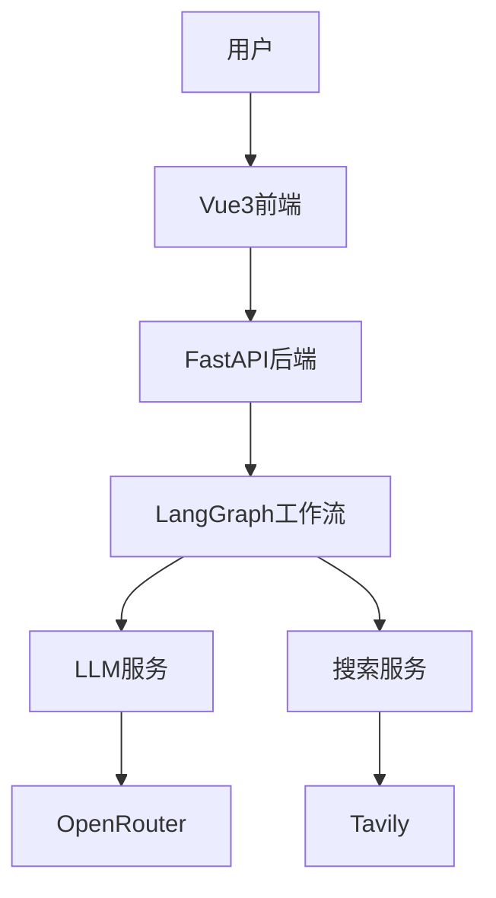
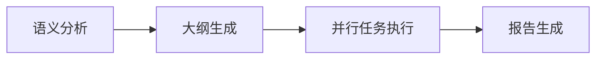

# 深度研究应用 - 架构文档索引

> **快速理解**：本文档是架构文档的导航入口，帮助快速定位所需信息。

---

## 📚 文档清单

| 文档 | 适用人群 | 核心内容 |
|------|---------|---------|
| [技术架构文档.md](./技术架构文档.md) | 架构师、技术负责人 | 系统架构、技术选型、部署方案 |
| [代码架构详解.md](./代码架构详解.md) | 开发者、代码审查者 | 模块设计、类关系、数据流 |
| [快速上手指南.md](./快速上手指南.md) | 新用户、产品经理 | 安装配置、使用流程、FAQ |
| [开发指南.md](./开发指南.md) | 开发者、运维工程师 | 扩展开发、调试技巧、部署 |

---

## 🎯 按场景查找

### 我是新用户，想快速体验

👉 阅读 [快速上手指南.md](./快速上手指南.md)

- 5分钟启动项目
- 配置API密钥
- 完成第一次研究

### 我想了解系统整体架构

👉 阅读 [技术架构文档.md](./技术架构文档.md)

- 技术栈详情
- 系统架构图
- 核心工作流程
- 性能优化策略

### 我要修改代码或添加功能

👉 阅读 [代码架构详解.md](./代码架构详解.md)

- 核心类与职责
- 数据流转示例
- 关键代码位置速查
- 常见问题排查

### 我要扩展新功能或部署到生产环境

👉 阅读 [开发指南.md](./开发指南.md)

- 添加工作流节点
- 集成新搜索源
- 创建Skill技能
- Docker部署
- 监控与日志

---

## 🔍 快速检索

### 想了解...

| 主题 | 查看文档 | 章节 |
|------|---------|------|
| **如何启动项目** | 快速上手指南 | 🚀 一键启动 |
| **API密钥配置** | 快速上手指南 | 🔑 配置API密钥 |
| **技术栈选型** | 技术架构文档 | 🏗️ 技术栈详情 |
| **工作流原理** | 技术架构文档 | 🔄 核心工作流程 |
| **LLM服务实现** | 代码架构详解 | 2. LLM服务 |
| **并行执行优化** | 代码架构详解 | 4. 研究工作流 |
| **SSE流式输出** | 代码架构详解 | 6. API路由 |
| **添加新节点** | 开发指南 | 🔧 扩展开发 |
| **Docker部署** | 开发指南 | 🚀 部署指南 |
| **调试技巧** | 开发指南 | 🐛 调试技巧 |

---

## 📊 架构图预览

### 系统架构

### 工作流程

---

## 💡 使用建议

### 首次阅读顺序

1. **快速上手指南** - 了解基本用法
2. **技术架构文档** - 理解系统设计
3. **代码架构详解** - 深入代码实现
4. **开发指南** - 开始扩展开发

### 遇到问题时

1. 查看对应文档的 **常见问题** 章节
2. 检查 **调试技巧** 部分
3. 查阅 **关键代码位置速查** 表
4. 查看浏览器控制台和后端日志

---

## 🔄 文档更新记录

| 版本 | 日期 | 更新内容 |
|------|------|---------|
| v1.0 | 2026-05-07 | 初始版本，包含4个核心文档 |

---

## 📞 反馈与建议

如发现文档问题或有改进建议，请：

1. 提交Issue到项目仓库
2. 联系开发团队
3. 直接修改并提交PR

---

**最后更新**: 2026-05-07  
**维护者**: 开发团队
