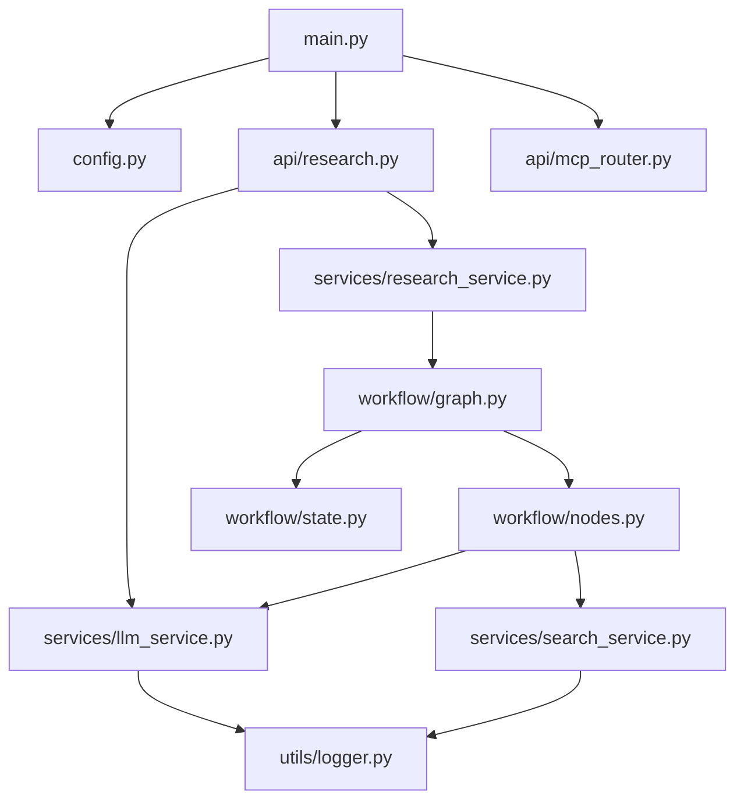

# 深度研究应用 - 代码架构详解

> **快速理解**：本文档深入解析核心模块的代码实现、类关系和数据流，帮助开发者快速定位和理解关键代码。

---

## 📦 核心模块依赖关系



---

## 🔑 核心类与职责

### 1. 配置管理 (config.py)

```python
class Settings(BaseSettings):
    """项目配置中心 - 单例模式"""
    
    # 配置验证逻辑
    def __init__(self):
        super().__init__()
        # 强制检查API密钥
        if not self.OPENROUTER_API_KEY:
            raise ValueError("缺少OpenRouter密钥")
```

**关键点**：
- 使用Pydantic自动类型验证
- `extra = "allow"` 允许额外环境变量
- 启动时立即验证必填项

---

### 2. LLM服务 (services/llm_service.py)

#### 类结构

```python
class LLMService:
    """LLM服务 - 封装OpenRouter调用"""
    
    def __init__(self):
        # 普通客户端（非流式）
        self.client = ChatOpenAI(...)
        
        # 流式客户端
        self.stream_client = ChatOpenAI(
            streaming=True,  # 关键参数
            ...
        )
    
    # 核心方法
    async def analyze_query()           # 语义分析
    async def generate_outline()        # 大纲生成
    async def generate_search_keywords() # 关键词生成
    async def analyze_search_results()  # 结果分析
    async def generate_report()         # 报告生成（非流式）
    async def generate_report_stream()  # 报告生成（流式）⭐
```

#### 流式生成实现

```python
async def generate_report_stream(self, query, outline, analyses, citations):
    """流式生成报告 - AsyncGenerator"""
    
    # 1. 构建prompt
    prompt = f"""...{citations_text}..."""
    
    # 2. 流式调用LLM
    async for chunk in self.stream_client.astream(messages):
        if hasattr(chunk, 'content') and chunk.content:
            yield chunk.content  # 逐字返回
```

**设计亮点**：
- 分离流式/非流式客户端
- 使用`AsyncGenerator`实现真正的流式
- 支持引用数据注入

---

### 3. 搜索服务 (services/search_service.py)

```python
class SearchService:
    """搜索服务 - Tavily API封装"""
    
    async def search(self, query: str) -> List[Dict]:
        """单次搜索"""
        results = self.tavily_client.search(query)
        return self._format_results(results)
    
    async def batch_search(self, queries: List[str]) -> List[Dict]:
        """批量搜索 + 去重"""
        all_results = []
        for query in queries:
            results = await self.search(query)
            all_results.extend(results)
        
        return deduplicate_results(all_results)  # URL去重
```

**去重逻辑**：
```python
def deduplicate_results(results: List[Dict]) -> List[Dict]:
    """基于URL哈希去重"""
    seen_urls = set()
    unique_results = []
    
    for result in results:
        url_hash = hash(result['url'])
        if url_hash not in seen_urls:
            seen_urls.add(url_hash)
            unique_results.append(result)
    
    return unique_results
```

---

### 4. 研究工作流 (workflow/)

#### 状态定义 (state.py)

```python
from typing import TypedDict, List, Dict, Any

class ResearchState(TypedDict):
    """工作流状态 - LangGraph状态机"""
    
    research_id: str
    query: str
    analysis: Dict[str, Any]
    outline: List[Dict]
    tasks: List[Dict]
    current_task_index: int
    report: str
    citations: Dict
    status: str
    error: str | None
```

#### 工作流图 (graph.py)

```python
def create_research_graph():
    """创建4节点线性工作流"""
    
    workflow = StateGraph(ResearchState)
    
    # 添加节点
    workflow.add_node('analyze_query', analyze_query_node)
    workflow.add_node('generate_outline', generate_outline_node)
    workflow.add_node('execute_tasks', execute_tasks_parallel_node)
    workflow.add_node('generate_report', generate_report_node)
    
    # 定义边（线性流程）
    workflow.set_entry_point('analyze_query')
    workflow.add_edge('analyze_query', 'generate_outline')
    workflow.add_edge('generate_outline', 'execute_tasks')
    workflow.add_edge('execute_tasks', 'generate_report')
    workflow.add_edge('generate_report', END)
    
    return workflow.compile()
```

#### 并行执行节点 (nodes.py)

```python
async def execute_tasks_parallel_node(state: ResearchState):
    """并行执行所有任务 - 性能优化关键"""
    
    tasks = state['tasks']
    
    # 并行执行所有任务
    results = await asyncio.gather(*[
        execute_single_task(task, state['query'])
        for task in tasks
    ])
    
    # 更新任务状态
    for i, result in enumerate(results):
        tasks[i].update(result)
        tasks[i]['status'] = 'completed'
    
    return {'tasks': tasks}
```

**对比串行执行**：
- 串行：8个任务 × 30秒 = 240秒
- 并行：max(30秒) = 30秒
- **性能提升8倍** ⚡

---

### 5. 研究服务 (services/research_service.py)

```python
class ResearchService:
    """研究服务 - 状态管理 + 工作流触发"""
    
    def __init__(self):
        self.research_store = {}  # 内存存储（待改为Redis）
    
    async def start_research(self, query: str) -> str:
        """启动研究 - 异步后台执行"""
        
        research_id = self._generate_id()
        
        # 初始化状态
        initial_state = {
            'research_id': research_id,
            'query': query,
            'status': 'starting',
            ...
        }
        
        self.research_store[research_id] = initial_state
        
        # 后台执行工作流（不阻塞）
        asyncio.create_task(self._run_workflow(research_id, initial_state))
        
        return research_id
    
    async def _run_workflow(self, research_id, initial_state):
        """执行LangGraph工作流"""
        
        final_state = await research_graph.ainvoke(initial_state)
        
        # 更新状态
        self.research_store[research_id] = final_state
```

**关键设计**：
- `asyncio.create_task()` 实现后台执行
- 前端通过轮询/SSE获取进度
- 当前使用内存存储（重启丢失）

---

### 6. API路由 (api/research.py)

#### REST接口

```python
@router.post("/start")
async def start_research(request: StartResearchRequest):
    """启动研究"""
    research_id = await research_service.start_research(request.query)
    return {"research_id": research_id, "status": "started"}

@router.get("/{id}/progress")
async def get_progress(id: str):
    """查询进度"""
    return await research_service.get_research_progress(id)
```

#### SSE流式接口 ⭐

```python
@router.get("/{id}/stream")
async def stream_report(id: str):
    """SSE流式输出报告"""
    
    async def generate():
        # 1. 发送引用数据
        yield f"data: {json.dumps({'searchResults': results})}\n\n"
        
        # 2. 流式生成报告
        async for chunk in llm_service.generate_report_stream(...):
            yield f"data: {json.dumps({'content': chunk})}\n\n"
        
        # 3. 结束标记
        yield f"data: {json.dumps({'done': True})}\n\n"
    
    return StreamingResponse(
        generate(),
        media_type="text/event-stream",
        headers={
            "Cache-Control": "no-cache",
            "X-Accel-Buffering": "no"  # 禁用Nginx缓冲
        }
    )
```

**SSE格式要求**：
```
data: {"content": "报"}\n\n
data: {"content": "告"}\n\n
data: {"done": true}\n\n
```

---

### 7. 前端状态管理 (stores/research.js)

```javascript
import { defineStore } from 'pinia'
import axios from 'axios'

export const useResearchStore = defineStore('research', {
    state: () => ({
        currentResearch: null,
        isProcessing: false,
        progressLogs: []
    }),
    
    actions: {
        async startResearch(query) {
            this.isProcessing = true
            
            // 1. 启动研究
            const { data } = await axios.post('/api/research/start', { query })
            const researchId = data.research_id
            
            // 2. 轮询进度
            this.pollProgress(researchId)
            
            // 3. 流式获取报告
            this.streamReport(researchId)
        },
        
        async streamReport(researchId) {
            const response = await fetch(`/api/research/${researchId}/stream`)
            const reader = response.body.getReader()
            
            while (true) {
                const { done, value } = await reader.read()
                if (done) break
                
                // 解析SSE事件
                const text = new TextDecoder().decode(value)
                const lines = text.split('\n')
                
                for (const line of lines) {
                    if (line.startsWith('data: ')) {
                        const data = JSON.parse(line.slice(6))
                        
                        if (data.searchResults) {
                            // 处理引用数据
                            this.handleSearchResults(data.searchResults)
                        } else if (data.content) {
                            // 追加报告内容
                            this.currentResearch.report += data.content
                        }
                    }
                }
            }
        }
    }
})
```

**关键技术点**：
- 使用`fetch`而非`axios`（支持ReadableStream）
- `TextDecoder`解码二进制流
- 逐行解析SSE事件

---

## 🔄 数据流转示例

### 完整研究流程数据流

```
用户输入问题
    ↓
[POST /api/research/start]
    ↓
ResearchService.start_research()
    ↓
生成research_id → 存入research_store
    ↓
asyncio.create_task(_run_workflow)  ← 后台执行
    ↓
LangGraph工作流启动
    ↓
┌─ analyze_query_node
│   └→ LLMService.analyze_query()
│       └→ OpenRouter API
│           └→ 返回analysis字典
│
├─ generate_outline_node
│   └→ LLMService.generate_outline()
│       └→ 返回5-8个任务列表
│
├─ execute_tasks_parallel_node
│   └→ asyncio.gather([
│       ├─ Task1: search → analyze
│       ├─ Task2: search → analyze
│       └─ ...
│   ])
│
└─ generate_report_node
    └→ 返回report字符串（非流式）
        ↓
更新research_store状态为completed
    ↓
[前端轮询GET /api/research/{id}/progress]
    ↓
检测到status=completed
    ↓
[GET /api/research/{id}/stream]
    ↓
StreamingResponse逐字推送
    ↓
前端实时显示报告
```

---

## 🎯 关键代码位置速查

| 功能 | 文件路径 | 关键函数/类 |
|------|---------|------------|
| **启动研究** | `services/research_service.py` | `start_research()` |
| **语义分析** | `services/llm_service.py` | `analyze_query()` |
| **流式生成** | `services/llm_service.py` | `generate_report_stream()` |
| **并行执行** | `workflow/nodes.py` | `execute_tasks_parallel_node()` |
| **SSE接口** | `api/research.py` | `stream_report()` |
| **状态管理** | `stores/research.js` | `useResearchStore` |
| **配置加载** | `config.py` | `Settings`类 |
| **日志工具** | `utils/logger.py` | `get_logger()` |

---

## 🐛 常见问题排查

### 1. 流式输出不工作

**检查清单**：
```python
# 1. config.py中启用流式
STREAM_OUTPUT = True

# 2. LLM客户端启用streaming
self.stream_client = ChatOpenAI(streaming=True, ...)

# 3. SSE响应头正确
headers={"X-Accel-Buffering": "no"}
```

### 2. 并行执行未生效

**检查点**：
```python
# 确保使用asyncio.gather而非for循环
results = await asyncio.gather(*[task() for task in tasks])

# ❌ 错误写法（串行）
for task in tasks:
    result = await task()
```

### 3. 引用数据未传递

**调试步骤**：
```python
# 1. 检查nodes.py中是否收集citations
logger.info(f"citations数量: {len(citations)}")

# 2. 检查SSE是否发送searchResults
yield f"data: {json.dumps({'searchResults': results})}\n\n"

# 3. 前端是否正确解析
console.log('收到searchResults:', data.searchResults)
```

---

## 📊 性能指标参考

| 操作 | 耗时 | 优化空间 |
|------|------|---------|
| 语义分析 | 2-5秒 | 缓存常见问题分析 |
| 大纲生成 | 3-8秒 | 模板化大纲结构 |
| 单次搜索 | 1-3秒 | 并发搜索 |
| 结果分析 | 5-10秒/任务 | 并行执行✅已实现 |
| 报告生成 | 10-30秒 | 流式输出✅已实现 |
| **总耗时** | **60-120秒** | **目标<60秒** |

---

**文档版本**: v1.0  
**最后更新**: 2026-05-07  
**维护者**: 开发团队
