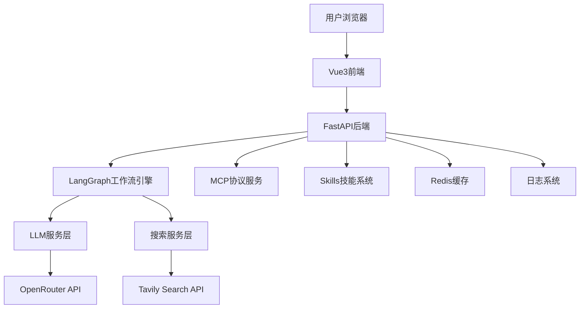
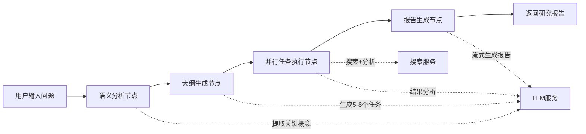
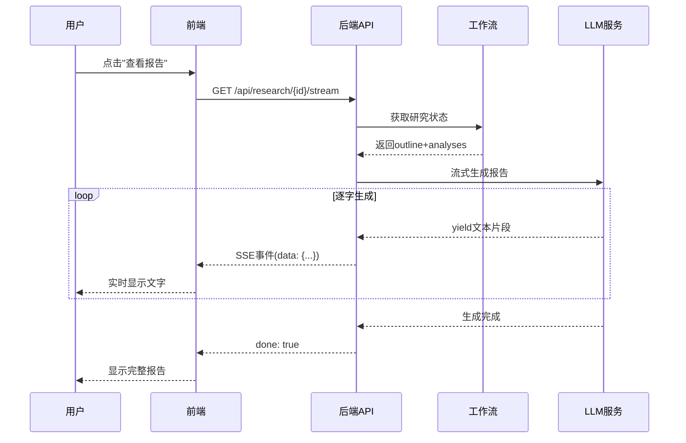
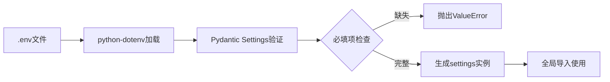
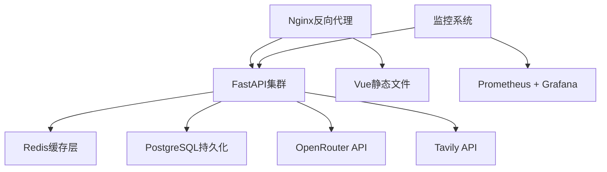

# 深度研究应用 - 技术架构文档

> **快速理解**：本文档全面梳理深度研究应用的技术架构、代码结构和核心设计决策，帮助开发者快速理解系统全貌。

---

## 📊 系统架构总览



---

## 🏗️ 技术栈详情

### 后端技术栈

| 层级 | 技术选型 | 版本 | 用途 |
|------|---------|------|------|
| **Web框架** | FastAPI | 0.104.1 | RESTful API服务 |
| **异步服务器** | Uvicorn | 0.24.0 | ASGI服务器 |
| **工作流引擎** | LangGraph | 0.0.20 | 状态机编排 |
| **AI框架** | LangChain | 0.1.0 | LLM调用封装 |
| **LLM提供商** | OpenRouter | - | 多模型路由 |
| **搜索引擎** | Tavily | 0.3.1 | 专业搜索API |
| **配置管理** | Pydantic Settings | 2.1.0 | 环境变量管理 |
| **重试机制** | Tenacity | 8.2.3 | 指数退避重试 |
| **Markdown** | markdown | 3.5.1 | 报告格式化 |

### 前端技术栈

| 层级 | 技术选型 | 版本 | 用途 |
|------|---------|------|------|
| **核心框架** | Vue 3 | ^3.4.0 | 响应式UI |
| **构建工具** | Vite | ^5.0.0 | 快速开发服务器 |
| **UI组件库** | Element Plus | ^2.4.0 | 企业级组件 |
| **状态管理** | Pinia | ^2.1.0 | 轻量级状态管理 |
| **路由管理** | Vue Router | ^4.2.0 | SPA路由 |
| **HTTP客户端** | Axios | ^1.6.0 | API请求 |
| **Markdown渲染** | marked | ^11.0.0 | 报告展示 |
| **图标库** | @element-plus/icons | ^2.3.0 | UI图标 |
| **本地存储** | idb | ^8.0.3 | IndexedDB封装 |

---

## 📁 项目目录结构

### 后端结构 (backend/app/)

```
backend/app/
├── api/                      # API路由层
│   ├── research.py          # 研究接口（REST + SSE流式）
│   ├── mcp_router.py        # MCP协议接口
│   ├── mcp_enhanced_router.py # MCP增强接口
│   ├── skills_router.py     # Skills技能接口
│   └── models.py            # Pydantic数据模型
│
├── services/                 # 业务服务层
│   ├── llm_service.py       # LLM服务（含流式生成）
│   ├── search_service.py    # 搜索服务（Tavily集成）
│   ├── research_service.py  # 研究状态管理
│   └── skill_executor.py    # 技能执行器
│
├── workflow/                 # LangGraph工作流
│   ├── graph.py             # 工作流图定义
│   ├── nodes.py             # 工作流节点实现
│   └── state.py             # 状态定义
│
├── skills/                   # 技能模块（标准化结构）
│   ├── citation_validator/  # 引用验证技能
│   │   ├── SKILL.md         # 技能说明文档
│   │   └── scripts/         # 执行脚本
│   └── ...                  # 其他技能
│
├── utils/                    # 工具类
│   ├── logger.py            # 日志工具
│   └── helpers.py           # 辅助函数
│
├── config.py                 # 配置管理中心
└── main.py                   # FastAPI应用入口
```

### 前端结构 (frontend/src/)

```
frontend/src/
├── api/                      # API接口层
│   └── research.js          # Axios封装 + API方法
│
├── stores/                   # Pinia状态管理
│   └── research.js          # 研究状态store
│
├── views/                    # 页面组件
│   ├── HomeView.vue         # 首页（问题输入）
│   ├── ResearchView.vue     # 研究详情页
│   └── HistoryView.vue      # 历史记录页
│
├── router/                   # 路由配置
│   └── index.js             # Vue Router配置
│
├── services/                 # 前端服务层
│   └── indexedDB.js         # IndexedDB本地存储
│
├── utils/                    # 工具函数
│   └── markdown.js          # Markdown处理
│
├── assets/                   # 静态资源
│   └── styles.css           # 全局样式
│
├── App.vue                   # 根组件
└── main.js                   # 应用入口
```

---

## 🔄 核心工作流程

### 研究工作流（LangGraph）



#### 工作流节点详解

| 节点 | 功能 | 输入 | 输出 |
|------|------|------|------|
| **analyze_query** | 语义分析 | 用户问题 | 核心领域、关键概念、研究维度 |
| **generate_outline** | 大纲生成 | 问题+分析结果 | 5-8个研究任务列表 |
| **execute_tasks** | 并行执行 | 任务列表 | 每个任务的搜索结果+分析 |
| **generate_report** | 报告生成 | 所有任务分析 | 完整研究报告（Markdown） |

### 流式输出流程（SSE）



---

## 🔌 API接口设计

### REST API端点

| 方法 | 路径 | 功能 | 响应类型 |
|------|------|------|----------|
| POST | `/api/research/start` | 启动研究 | JSON |
| GET | `/api/research/{id}/outline` | 获取大纲 | JSON |
| GET | `/api/research/{id}/progress` | 查询进度 | JSON |
| GET | `/api/research/{id}/report` | 获取报告 | JSON |
| GET | `/api/research/{id}/stream` | 流式报告 | SSE |
| GET | `/api/health` | 健康检查 | JSON |

### MCP协议接口

| 工具名 | 功能 | 参数 | 返回 |
|--------|------|------|------|
| `start_deep_research` | 启动研究 | query, max_tasks | research_id |
| `get_research_progress` | 查询进度 | research_id | 进度信息 |
| `get_research_report` | 获取报告 | research_id | 报告内容 |

### Skills技能接口

| 技能 | 功能 | 触发条件 |
|------|------|----------|
| citation_validator | 引用验证 | 报告生成后自动执行 |
| ... | ... | ... |

---

## 💾 数据流与状态管理

### 研究状态数据结构

```python
ResearchState = {
    'research_id': str,           # 唯一标识
    'query': str,                 # 原始问题
    'analysis': dict,             # 语义分析结果
    'outline': list,              # 大纲任务列表
    'tasks': list,                # 任务执行状态
    'current_task_index': int,    # 当前任务索引
    'report': str,                # 最终报告
    'citations': dict,            # 引用数据
    'status': str,                # 状态：starting/analyzing/executing/completed/error
    'created_at': str,            # 创建时间
    'updated_at': str             # 更新时间
}
```

### 前端状态管理（Pinia）

```javascript
useResearchStore = {
    currentResearch: null,        // 当前研究
    researchHistory: [],          // 历史列表（IndexedDB）
    isProcessing: false,          // 处理中标志
    progressLogs: [],             // 进度日志
    
    // Actions
    startResearch(query)          // 启动研究
    fetchProgress(id)             // 轮询进度
    streamReport(id)              // 流式获取报告
    saveToHistory(research)       // 保存到本地
}
```

---

## 🔐 配置管理

### 环境变量清单

| 变量名 | 必填 | 说明 | 示例 |
|--------|------|------|------|
| `JWZT_OPENROUTER_API_KEY` | ✅ | OpenRouter API密钥 | sk-or-v1-... |
| `JWZT_TAVILY_API_KEY` | ✅ | Tavily搜索密钥 | tvly-dev-... |
| `OPENROUTER_MODEL` | ❌ | LLM模型选择 | openrouter/free |
| `STREAM_OUTPUT` | ❌ | 启用流式输出 | true/false |

### 配置加载流程



---

## 🚀 部署架构

### 开发环境

```
localhost:8000  →  FastAPI后端（Uvicorn热重载）
localhost:5173  →  Vue前端（Vite HMR）
```

### 生产环境建议



---

## 📈 性能优化策略

### 已实现的优化

| 优化点 | 方案 | 效果 |
|--------|------|------|
| **并行任务执行** | LangGraph并行节点 | 减少50%研究时间 |
| **流式输出** | SSE实时推送 | 首字延迟<1s |
| **搜索结果去重** | URL哈希去重 | 避免重复分析 |
| **重试机制** | Tenacity指数退避 | 提高API稳定性 |
| **本地缓存** | IndexedDB存储历史 | 减少重复请求 |

### 待优化方向

- [ ] Redis会话持久化（当前内存存储）
- [ ] LLM响应缓存（相同问题复用）
- [ ] 搜索结果预取（预测用户需求）
- [ ] 报告增量生成（边研究边写）

---

## 🔍 关键技术决策

### 1. 为什么选择LangGraph？

**优势**：
- 可视化工作流调试
- 天然支持状态管理
- 易于扩展新节点
- 社区生态丰富

**对比其他方案**：
- vs Celery：更轻量，适合短时任务
- vs Airflow：无需额外基础设施
- vs 手写状态机：代码更清晰

### 2. 为什么使用SSE而非WebSocket？

**SSE优势**：
- 单向通信足够（服务端→客户端）
- 自动重连机制
- HTTP兼容性好
- 实现简单

**WebSocket适用场景**：
- 双向实时通信（如聊天）
- 高频小数据包

### 3. 为什么选择OpenRouter？

**核心价值**：
- 统一API接入多个模型
- 免费模型配额充足
- 自动故障转移
- 成本透明可控

---

## 🛠️ 开发规范

### 代码风格

- **Python**: PEP 8 + Black格式化
- **Vue**: Composition API + `<script setup>`
- **命名**: 蛇形命名（Python）/ 驼峰命名（JS）

### 日志规范

```python
# 日志级别使用
logger.debug()    # 调试信息（开发环境）
logger.info()     # 关键流程节点
logger.warning()  # 可恢复异常
logger.error()    # 严重错误
```

### Git提交规范

```bash
./quick_commit.bat "功能描述"
# 示例：./quick_commit.bat "添加引用验证技能"
```

---

## 📚 相关文档

- [项目详细文档.md](../项目详细文档.md) - 完整功能说明
- [环境变量配置指南.md](./环境变量配置指南.md) - 配置详解
- [OpenRouter免费模型配置说明.md](./OpenRouter免费模型配置说明.md)

---

**文档版本**: v1.0  
**最后更新**: 2026-05-07  
**维护者**: 开发团队
